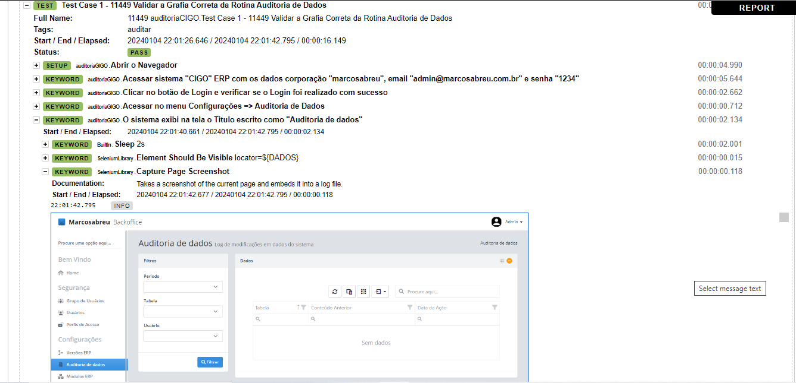

## Teste 11449 Grafia Auditoria de Dados - Backoffice e ERP - Results

# Test Case 1 - 11449 Validar a Grafia Correta da Rotina Auditoria de Dados

  

# Test Case 2 - 11449 Validar a Grafia Incorreta da Rotina Auditoria de Dados  

  

